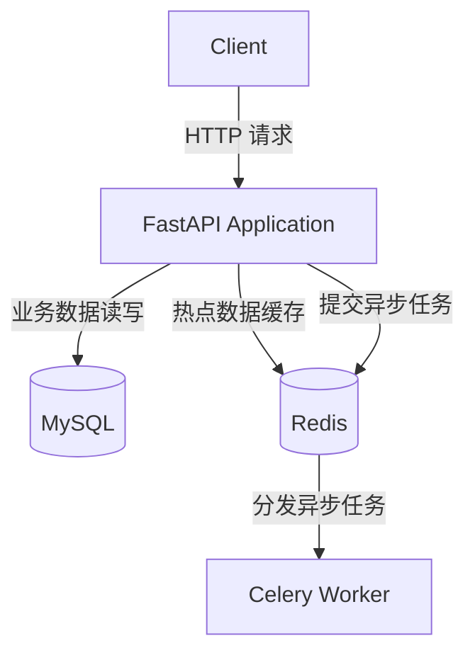
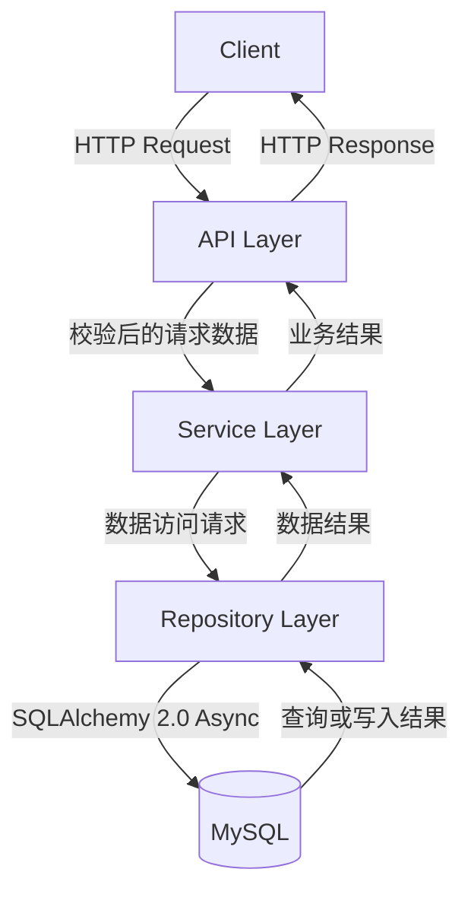
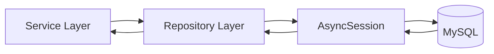
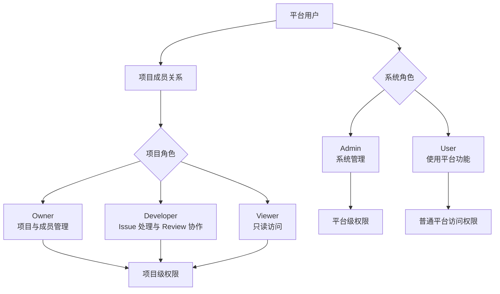
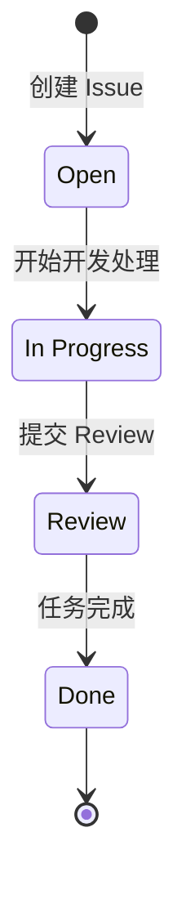
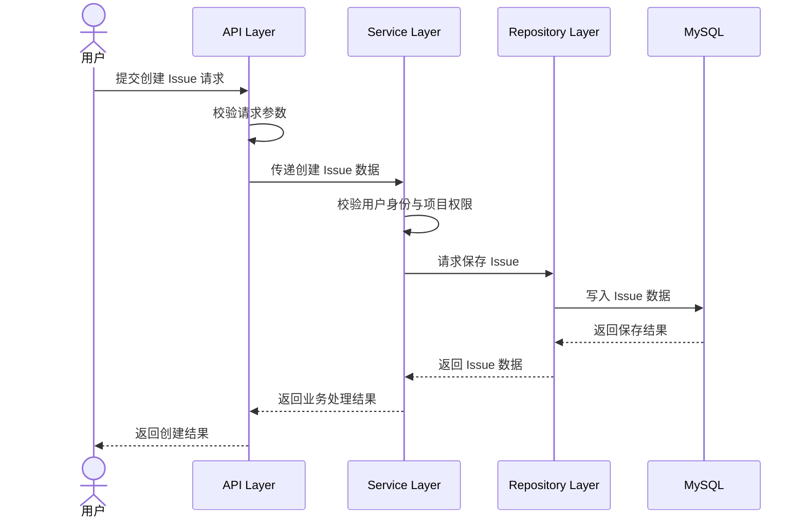
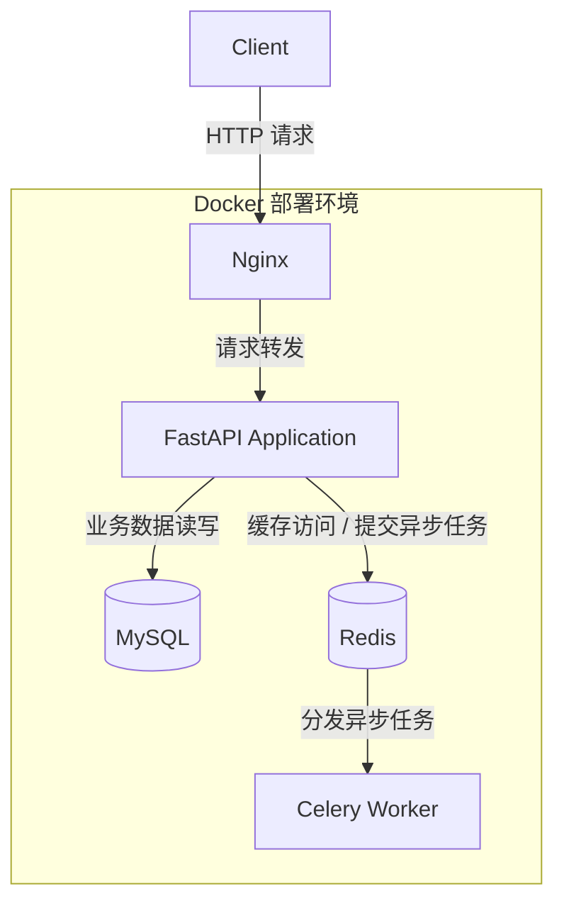

# DevFlow 企业研发协作平台系统设计文档

## 1. 系统整体架构设计

DevFlow 是一个面向软件研发团队的企业级研发协作平台，用于模拟项目创建、成员管理、Issue 分配、开发处理、Code Review、任务完成及消息通知等典型研发协作流程。系统参考 Jira 的项目管理能力和 GitHub 的部分代码协作流程，但不承担完整 Git 仓库管理职责。

系统采用 `FastAPI + MySQL + Redis + Celery + Docker` 的整体技术架构，各组件职责如下：

| 组件 | 主要职责 |
| --- | --- |
| Client | 作为用户访问系统的入口，向后端服务发起 HTTP 请求 |
| FastAPI Application | 提供业务 API，完成身份与权限校验、业务流程编排及数据访问协调 |
| MySQL | 持久化用户、项目、Issue、评论和 Review 等关系型业务数据 |
| Redis | 缓存热点数据，并为异步任务提供支撑 |
| Celery Worker | 执行后台任务和异步通知任务 |

系统整体架构如下：



核心请求由 FastAPI Application 统一接收。需要持久化的数据写入 MySQL，适合缓存的热点数据存储于 Redis；不要求在当前请求中同步完成的后台任务和通知任务通过 Redis 交由 Celery Worker 处理。

## 2. 后端分层架构设计

DevFlow 后端采用经典三层架构，将接口接入、业务逻辑和数据访问进行职责分离。标准调用方向为 `API Layer → Service Layer → Repository Layer`，数据库访问统一由 Repository Layer 完成。



### 2.1 API Layer

API Layer 是后端服务的 HTTP 接入层，负责：

- 提供 HTTP 接口；
- 接收请求路径、查询参数及请求体；
- 完成请求参数校验；
- 调用对应的 Service 完成业务处理；
- 将处理结果转换为统一的 HTTP 响应。

API Layer 不承载核心业务规则，也不直接访问数据库。系统接口采用版本管理，当前统一使用 `/api/v1` 前缀，例如：

```text
GET  /api/v1/users/me
POST /api/v1/issues
```

### 2.2 Service Layer

Service Layer 负责承载业务逻辑和业务流程编排，是系统业务规则的主要实现层。其职责包括：

- 执行业务条件校验；
- 校验用户身份及业务权限；
- 协调一个或多个数据访问操作；
- 维护项目、Issue、评论和 Review 等业务规则；
- 向 API Layer 返回业务处理结果。

以创建 Issue 为例，Service Layer 负责依次完成用户身份校验、项目权限校验、Issue 创建规则处理和结果返回。Service Layer 不直接操作数据库，而是通过 Repository Layer 访问数据。

### 2.3 Repository Layer

Repository Layer 负责封装数据访问逻辑，为 Service Layer 提供稳定的数据操作入口。其职责包括：

- 查询用户及其相关数据；
- 保存和查询项目信息；
- 创建、查询及更新 Issue；
- 使用 SQLAlchemy 2.0 Async 与 MySQL 交互；
- 向 Service Layer 返回数据访问结果。

通过 Repository Layer 统一封装数据库操作，可以避免业务逻辑依赖具体数据访问细节，保持分层边界清晰。

## 3. API版本设计

DevFlow 采用基于 URL 路径的 API Versioning 方案。当前版本为 `/api/v1`，所有对外业务接口均归属于 v1 路由。

```text
/api/v1/users
/api/v1/projects
/api/v1/issues
/api/v1/comments
/api/v1/reviews
```

API 版本管理的主要目的包括：

- 明确客户端所使用的接口契约；
- 在接口演进过程中保持已有版本兼容性；
- 为未来无法向后兼容的接口升级保留独立版本空间。

未来如需发布不兼容的新接口，可以使用 `/api/v2` 前缀，例如：

```text
/api/v2/users
```

当前项目仅实现 `/api/v1`，不同时维护多个 API 版本。

## 4. 后端项目结构设计

后端项目以 `backend/app` 为应用根目录，按照 API、Service、Repository 及公共基础能力组织代码。

```text
backend
└── app
    ├── main.py
    ├── api
    │   └── v1
    │       ├── router.py
    │       ├── users.py
    │       ├── projects.py
    │       ├── issues.py
    │       ├── comments.py
    │       └── reviews.py
    ├── services
    │   ├── user_service.py
    │   ├── project_service.py
    │   ├── issue_service.py
    │   └── comment_service.py
    ├── repositories
    │   ├── user_repository.py
    │   ├── project_repository.py
    │   └── issue_repository.py
    ├── models
    ├── schemas
    ├── core
    ├── database
    └── tests
```

各目录及文件的职责如下：

| 路径 | 职责 |
| --- | --- |
| `app/main.py` | FastAPI 应用入口，负责应用创建及路由接入 |
| `app/api/v1/` | v1 版本 API 定义，接收请求并返回响应 |
| `app/api/v1/router.py` | 聚合并注册 v1 各业务模块路由 |
| `app/services/` | 承载业务规则及业务流程编排 |
| `app/repositories/` | 封装数据库查询、保存和更新操作 |
| `app/models/` | 定义持久化数据模型 |
| `app/schemas/` | 集中管理请求校验和响应转换所需的 Schema |
| `app/core/` | 存放应用核心公共配置与基础能力 |
| `app/database/` | 管理数据库连接及会话相关能力 |
| `app/tests/` | 存放系统测试 |

该目录结构以 `API Layer + Service Layer + Repository Layer` 为主线，实现业务逻辑与数据访问分离，并使不同业务模块能够按照统一方式组织。

## 5. 业务模块设计

### 5.1 用户模块

用户模块负责平台用户身份及用户信息相关业务，包括：

- 用户注册；
- 用户登录；
- 用户信息管理。

其主要分层对应关系如下：

| 分层 | 对应文件 | 职责 |
| --- | --- | --- |
| API Layer | `api/v1/users.py` | 接收用户相关请求并返回响应 |
| Service Layer | `services/user_service.py` | 处理注册、登录及用户信息业务规则 |
| Repository Layer | `repositories/user_repository.py` | 查询和保存用户数据 |

### 5.2 项目模块

项目模块用于建立研发协作空间并管理项目范围内的成员和角色，包括：

- 创建项目；
- 项目信息管理；
- 项目成员管理；
- 项目角色管理。

该模块通过 `api/v1/projects.py` 接收项目相关请求，由 `services/project_service.py` 处理项目业务规则，并通过 `repositories/project_repository.py` 访问项目数据。

### 5.3 Issue模块

Issue 模块是 DevFlow 的核心业务模块，用于管理 Bug、Feature 和 Task 的处理过程，包括：

- 创建 Issue；
- 修改 Issue；
- 分配负责人；
- 管理 Issue 状态流转。

该模块通过 `api/v1/issues.py` 提供接口，由 `services/issue_service.py` 执行业务规则，并通过 `repositories/issue_repository.py` 完成数据访问。Issue 生命周期固定为：

```text
Open → In Progress → Review → Done
```

### 5.4 评论模块

评论模块用于支持项目成员围绕 Issue 进行沟通，包括：

- 添加 Issue 评论；
- 查看 Issue 评论；
- 支持团队围绕任务信息进行协作。

该模块通过 `api/v1/comments.py` 接收请求，由 `services/comment_service.py` 处理评论相关业务逻辑。

### 5.5 Review模块

Review 模块用于模拟 GitHub Pull Request 的部分审核流程，不管理真实代码仓库。该模块包括：

- 创建 Review 请求；
- 指定 Reviewer 并执行审核；
- 修改 Review 状态。

Review 模块通过 `api/v1/reviews.py` 提供接口，其状态包括 `Pending`、`Approved` 和 `Rejected`。该模块遵循统一的分层调用约束，API 层不直接访问数据库。

## 6. 数据访问设计

DevFlow 使用 MySQL 存储关系型业务数据，使用 SQLAlchemy 2.0 Async 完成异步 ORM 数据访问。标准数据访问流程如下：



Service Layer 仅表达业务意图，Repository Layer 将业务所需的数据操作转换为具体的 ORM 访问行为，再通过 `AsyncSession` 与 MySQL 交互。

设置 Repository Layer 的主要原因包括：

- 隔离数据库操作，集中维护查询、保存和更新逻辑；
- 降低业务代码与数据库访问方式之间的耦合；
- 防止 Service Layer 直接依赖 ORM 操作细节；
- 提高数据访问逻辑的可维护性；
- 保持不同业务模块的数据访问方式一致。

## 7. Schema设计

DevFlow 采用集中式 Schema 管理方式，由 `app/schemas` 目录统一组织各业务模块的请求与响应数据结构。例如：

```text
schemas/user.py
schemas/project.py
schemas/issue.py
```

Schema 的主要职责包括：

- 定义接口请求数据结构；
- 校验请求数据；
- 定义接口响应数据结构；
- 将业务处理结果转换为稳定的响应数据；
- 隔离 API 数据结构与数据库持久化模型。

集中式管理能够使请求和响应约束保持统一，避免数据校验规则散落在 API 或 Service 中，同时保持 Schema、业务逻辑与数据库模型之间的职责边界。

## 8. 权限模型设计

DevFlow 采用“系统角色 + 项目角色”的双层权限模型。系统角色控制平台级职责，项目角色控制用户在具体项目中的操作范围。

### 8.1 系统角色

| 系统角色 | 定位 |
| --- | --- |
| Admin | 系统管理员，负责平台级管理 |
| User | 普通用户，使用平台并参与项目协作 |

### 8.2 项目角色

| 项目角色 | 定位 |
| --- | --- |
| Owner | 项目负责人，负责项目及成员管理 |
| Developer | 开发人员，参与 Issue 处理和 Review 协作 |
| Viewer | 只读成员，查看项目及任务信息 |

双层权限关系如下：



权限校验应同时考虑用户身份、系统角色、项目成员关系和项目角色。项目内的资源访问由具体项目中的角色决定，避免用户因参与一个项目而获得其他项目的访问权限。

## 9. 核心业务流程设计

### 9.1 Issue生命周期

Issue 从创建到完成依次经过 `Open`、`In Progress`、`Review` 和 `Done` 四个状态。



各状态含义如下：

| 状态 | 含义 |
| --- | --- |
| Open | Issue 已创建，等待开发人员处理 |
| In Progress | Issue 正在开发处理中 |
| Review | 开发处理已完成，等待 Review |
| Done | Review 完成，Issue 已结束 |

### 9.2 创建Issue请求流程

创建 Issue 请求按照 API Layer、Service Layer 和 Repository Layer 的顺序处理。



该流程中，API Layer 负责请求接入与数据校验，Service Layer 负责身份、权限及业务规则校验，Repository Layer 负责将 Issue 数据持久化至 MySQL。

## 10. 部署架构设计

DevFlow 采用 Docker 进行容器化部署，通过统一的容器运行环境管理 Nginx、FastAPI、MySQL、Redis 和 Celery Worker。



部署组件职责如下：

- Nginx 作为系统访问入口，将客户端请求转发至 FastAPI Application；
- FastAPI Application 处理 HTTP 请求、业务逻辑和数据访问协调；
- MySQL 持久化系统核心业务数据；
- Redis 提供热点数据缓存并支撑异步任务；
- Celery Worker 从 Redis 获取任务，执行后台任务和异步通知；
- Docker 统一各组件的运行环境，降低环境差异并简化部署。

## 11. 技术选型说明

| 技术 | 选型原因 | 在系统中的用途 |
| --- | --- | --- |
| FastAPI | 具备较高性能，支持异步处理，Python 生态成熟 | 构建后端 HTTP API 和承载核心业务服务 |
| SQLAlchemy 2.0 Async | 提供成熟的 ORM 能力并支持异步数据库访问 | 通过 Repository Layer 和 AsyncSession 访问 MySQL |
| MySQL | 适合关系型数据存储，在企业应用中使用广泛 | 存储用户、项目、Issue、评论及 Review 等业务数据 |
| Redis | 支持高效缓存，并可为异步任务提供支撑 | 缓存热点数据及支撑 Celery 异步任务 |
| Celery | 提供后台任务处理能力 | 处理后台任务和异步通知 |
| Docker | 保证运行环境一致性并简化部署 | 容器化管理 Nginx、FastAPI、MySQL、Redis 和 Celery Worker |

上述技术均围绕单体后端应用的业务需求选取，在满足研发协作核心流程的同时，兼顾异步访问、数据持久化、缓存、后台任务及容器化部署需求，符合 DevFlow 个人秋招项目的规模定位。
