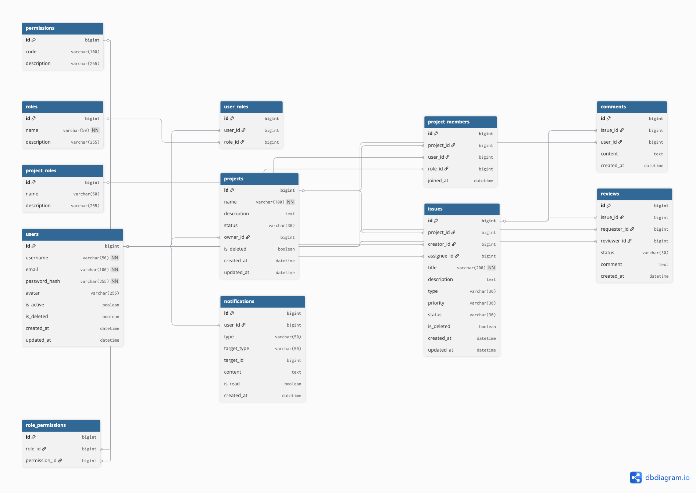

# DevFlow 数据库设计文档

## 1. 数据库概述

DevFlow 是一个面向软件研发团队的企业研发协作平台，核心业务覆盖用户加入项目、项目成员协作、Issue 创建与处理、评论沟通、Code Review 以及通知提醒。数据库负责为上述业务提供统一、可靠的持久化数据基础。

本项目采用 MySQL 8.0 作为关系型数据库，使用 SQLAlchemy 2.0 Async 完成异步数据访问，并通过 Alembic 管理数据库结构迁移。数据库模型由 12 张核心表组成，覆盖用户权限、项目管理、研发协作和消息通知四个业务领域。

数据库设计目标如下：

- 准确表达用户、角色、项目、Issue 及协作数据之间的关系；
- 降低重复数据，保持业务数据的一致性；
- 通过主键、外键、唯一索引和非空约束保障数据完整性；
- 通过必要索引支持项目查询、用户任务查询和状态筛选；
- 为 SQLAlchemy Model 定义及 Alembic 迁移提供结构依据；
- 在保持当前业务模型简洁的同时，为后续合理扩展保留空间。

## 2. 数据库设计原则

### 2.1 关系模型设计

DevFlow 采用关系型数据库模型，通过实体表保存核心业务数据，通过关联表表达多对多关系，并使用外键维护实体之间的引用关系。

设计遵循以下原则：

- 清晰定义用户、权限、项目和研发协作实体的职责边界；
- 按照第三范式组织数据，减少重复字段和冗余关系；
- 通过关联表表达用户与角色、角色与权限、用户与项目之间的多对多关系；
- 使用外键约束保证关联记录指向有效实体；
- 使用唯一约束避免重复账号标识和重复关联关系。

### 2.2 分层设计

数据库层仅负责数据存储、关系维护和数据完整性约束，不承载业务流程判断。

- Service Layer 负责身份权限校验、业务规则执行和业务流程编排；
- Repository Layer 负责封装查询、写入、更新等数据访问操作；
- SQLAlchemy 2.0 Async 负责 ORM 映射与异步数据库访问；
- MySQL 负责数据持久化及约束执行。

该分层方式能够降低业务逻辑与数据访问细节之间的耦合，使数据库结构、Repository 和 Service 各自保持清晰职责。

### 2.3 软删除设计

用户、项目和 Issue 属于具有历史关联价值的核心业务数据，分别在 `users`、`projects` 和 `issues` 表中设置 `is_deleted` 字段实现软删除。

软删除机制不直接移除记录，而是通过删除标记表示数据已退出正常业务范围，其主要目的包括：

- 保留历史业务数据；
- 避免物理删除导致关联数据丢失；
- 保持历史项目和任务关系可追溯；
- 为必要的数据恢复提供基础。

Repository Layer 在读取正常业务数据时，应根据业务场景处理软删除标记；具体删除规则由 Service Layer 负责控制。

## 3. ER模型设计

DevFlow ER 模型围绕四个业务领域组织：

- 用户权限领域通过 `users`、`roles`、`permissions`、`user_roles` 和 `role_permissions` 构成完整 RBAC 关系；
- 项目领域通过 `projects`、`project_roles` 和 `project_members` 表达项目、用户和项目角色之间的关系；
- 研发协作领域以 `issues` 为核心，由 `comments` 和 `reviews` 记录任务讨论及审核过程；
- 消息领域通过 `notifications` 保存用户通知，并使用 `target_type` 与 `target_id` 定位通知关联对象。

核心实体关系包括：

- User 与 Role 通过 `user_roles` 建立多对多关系；
- Role 与 Permission 通过 `role_permissions` 建立多对多关系；
- User 与 Project 通过 `project_members` 建立多对多关系；
- 每个 Project 通过 `owner_id` 关联项目负责人；
- Project 与 Issue 为一对多关系；
- Issue 与 Comment、Review 均为一对多关系；
- User 与 Notification 为一对多关系。

## 4. 数据库实体总览

DevFlow 当前版本包含 12 张核心数据表，按业务领域划分如下：

| 业务领域 | 数据表 | 主要职责 |
| --- | --- | --- |
| 用户权限领域 | `users` | 保存系统用户基础信息 |
| 用户权限领域 | `roles` | 保存系统级角色 |
| 用户权限领域 | `permissions` | 保存系统操作权限 |
| 用户权限领域 | `user_roles` | 建立用户与系统角色的多对多关系 |
| 用户权限领域 | `role_permissions` | 建立系统角色与权限的多对多关系 |
| 项目领域 | `projects` | 保存研发项目及项目负责人信息 |
| 项目领域 | `project_roles` | 保存项目级角色 |
| 项目领域 | `project_members` | 建立用户、项目与项目角色之间的成员关系 |
| 研发协作领域 | `issues` | 保存 Bug、Feature 和 Task 等任务数据 |
| 研发协作领域 | `comments` | 保存 Issue 评论记录 |
| 研发协作领域 | `reviews` | 保存简化 Code Review 数据 |
| 消息领域 | `notifications` | 保存用户通知及其关联对象信息 |

## 5. 数据表详细设计

### 5.1 users 用户表

#### 表作用

`users` 表保存系统用户的基础信息、登录凭证摘要、启用状态和软删除状态，是角色分配、项目成员关系及研发协作行为的用户主体。

#### 字段说明

| 字段 | 类型 | 说明 |
| --- | --- | --- |
| `id` | BIGINT | 主键，自增 |
| `username` | VARCHAR(50) | 用户名，非空 |
| `email` | VARCHAR(100) | 用户邮箱，非空且唯一 |
| `password_hash` | VARCHAR(255) | 加密后的密码摘要，非空 |
| `avatar` | VARCHAR(255) | 用户头像地址 |
| `is_active` | BOOLEAN | 用户是否启用，默认值为 `true` |
| `is_deleted` | BOOLEAN | 软删除标记，默认值为 `false` |
| `created_at` | DATETIME | 用户创建时间 |
| `updated_at` | DATETIME | 用户信息更新时间 |

#### 设计说明

- `password_hash` 仅保存加密后的密码摘要，不保存明文密码；
- `email` 设置唯一索引，保证邮箱在系统内唯一；
- `is_active` 用于表示账号当前是否可用；
- `is_deleted` 用于实现用户数据软删除并保留历史关联。

### 5.2 roles 系统角色表

#### 表作用

`roles` 表保存平台级系统角色，用于定义用户在系统范围内的职责。当前初始化角色为 Admin 和 User。

#### 字段说明

| 字段 | 类型 | 说明 |
| --- | --- | --- |
| `id` | BIGINT | 主键，自增 |
| `name` | VARCHAR(50) | 系统角色名称，非空 |
| `description` | VARCHAR(255) | 系统角色说明 |

#### 设计说明

- 系统角色不直接存储在用户表中，而是通过 `user_roles` 与用户关联；
- 角色通过 `role_permissions` 关联权限，形成完整 RBAC 授权链路；
- 系统角色与项目角色相互独立，分别控制平台级和项目级权限。

### 5.3 permissions 权限表

#### 表作用

`permissions` 表保存系统操作权限。权限使用业务编码进行标识，例如 `project:create` 和 `issue:update`。

#### 字段说明

| 字段 | 类型 | 说明 |
| --- | --- | --- |
| `id` | BIGINT | 主键，自增 |
| `code` | VARCHAR(100) | 权限编码，具有唯一约束 |
| `description` | VARCHAR(255) | 权限用途说明 |

#### 设计说明

- `code` 是权限的业务标识，通过唯一索引避免重复权限编码；
- 权限不直接分配给用户，而是通过 `role_permissions` 分配给角色；
- 用户最终通过其系统角色获得相应权限。

### 5.4 user_roles 用户角色关联表

#### 表作用

`user_roles` 表建立 User 与 Role 之间的多对多关系，用于记录用户拥有的系统角色。

#### 字段说明

| 字段 | 类型 | 说明 |
| --- | --- | --- |
| `id` | BIGINT | 主键，自增 |
| `user_id` | BIGINT | 用户外键，关联 `users.id` |
| `role_id` | BIGINT | 系统角色外键，关联 `roles.id` |

#### 设计说明

- 一个用户可以拥有多个系统角色；
- 一个系统角色可以分配给多个用户；
- `(user_id, role_id)` 设置联合唯一索引，避免同一用户重复拥有同一角色。

### 5.5 role_permissions 角色权限关联表

#### 表作用

`role_permissions` 表建立 Role 与 Permission 之间的多对多关系，用于记录每个系统角色拥有的权限，是完整 RBAC 模型中的角色授权环节。

#### 字段说明

| 字段 | 类型 | 说明 |
| --- | --- | --- |
| `id` | BIGINT | 主键，自增 |
| `role_id` | BIGINT | 系统角色外键，关联 `roles.id` |
| `permission_id` | BIGINT | 权限外键，关联 `permissions.id` |

#### 设计说明

- 一个角色可以拥有多个权限；
- 一个权限可以分配给多个角色；
- `(role_id, permission_id)` 设置联合唯一索引，避免同一权限被重复分配给同一角色；
- RBAC 授权链路为 User → UserRole → Role → RolePermission → Permission。

### 5.6 projects 项目表

#### 表作用

`projects` 表保存研发项目基础信息及项目负责人，是项目成员管理和 Issue 协作的业务载体。

#### 字段说明

| 字段 | 类型 | 说明 |
| --- | --- | --- |
| `id` | BIGINT | 主键，自增 |
| `name` | VARCHAR(100) | 项目名称，非空 |
| `description` | TEXT | 项目描述 |
| `status` | VARCHAR(30) | 项目状态 |
| `owner_id` | BIGINT | 项目负责人外键，关联 `users.id` |
| `is_deleted` | BOOLEAN | 软删除标记，默认值为 `false` |
| `created_at` | DATETIME | 项目创建时间 |
| `updated_at` | DATETIME | 项目信息更新时间 |

#### 设计说明

- `owner_id` 直接关联项目负责人，项目负责人属于项目核心属性；
- 项目成员及其项目角色通过 `project_members` 维护；
- `owner_id` 与 `project_members` 分别表达项目负责人属性和项目成员关系，两者同时保留；
- `is_deleted` 用于实现项目软删除并保留历史任务与协作数据。

### 5.7 project_roles 项目角色表

#### 表作用

`project_roles` 表保存项目范围内的角色，用于描述项目成员在具体项目中的职责。当前初始化角色为 Owner、Developer 和 Viewer。

#### 字段说明

| 字段 | 类型 | 说明 |
| --- | --- | --- |
| `id` | BIGINT | 主键，自增 |
| `name` | VARCHAR(50) | 项目角色名称 |
| `description` | VARCHAR(255) | 项目角色说明 |

#### 设计说明

- Owner 表示项目负责人角色；
- Developer 表示参与 Issue 处理和 Review 协作的开发成员；
- Viewer 表示只读项目成员；
- 项目角色通过 `project_members.role_id` 分配给具体项目中的用户。

### 5.8 project_members 项目成员表

#### 表作用

`project_members` 表表示用户加入项目的成员关系，通过用户、项目和项目角色三个外键记录成员在具体项目中的身份。

#### 字段说明

| 字段 | 类型 | 说明 |
| --- | --- | --- |
| `id` | BIGINT | 主键，自增 |
| `project_id` | BIGINT | 项目外键，关联 `projects.id` |
| `user_id` | BIGINT | 用户外键，关联 `users.id` |
| `role_id` | BIGINT | 项目角色外键，关联 `project_roles.id` |
| `joined_at` | DATETIME | 用户加入项目的时间 |

#### 设计说明

- User 与 Project 通过该表形成多对多关系；
- 每条成员记录通过 `role_id` 指定用户在该项目中的项目角色；
- `(project_id, user_id)` 设置联合唯一索引，避免同一用户重复加入同一项目。

### 5.9 issues 任务表

#### 表作用

`issues` 表是 DevFlow 的核心业务表，用于保存项目中的 Bug、Feature 和 Task，并记录创建人、负责人、优先级及生命周期状态。

#### 字段说明

| 字段 | 类型 | 说明 |
| --- | --- | --- |
| `id` | BIGINT | 主键，自增 |
| `project_id` | BIGINT | 所属项目外键，关联 `projects.id` |
| `creator_id` | BIGINT | 创建人外键，关联 `users.id` |
| `assignee_id` | BIGINT | 负责人外键，关联 `users.id` |
| `title` | VARCHAR(200) | Issue 标题，非空 |
| `description` | TEXT | Issue 详细描述 |
| `type` | VARCHAR(30) | Issue 类型：`BUG`、`FEATURE`、`TASK` |
| `priority` | VARCHAR(30) | 优先级：`LOW`、`MEDIUM`、`HIGH`、`CRITICAL` |
| `status` | VARCHAR(30) | 状态：`OPEN`、`IN_PROGRESS`、`REVIEW`、`DONE` |
| `is_deleted` | BOOLEAN | 软删除标记，默认值为 `false` |
| `created_at` | DATETIME | Issue 创建时间 |
| `updated_at` | DATETIME | Issue 更新时间 |

#### 设计说明

- `project_id` 确定 Issue 所属项目；
- `creator_id` 与 `assignee_id` 分别表示创建人和当前负责人；
- `type` 区分缺陷、功能和一般任务；
- `status` 描述 Issue 从创建到完成的业务状态；
- `project_id`、`assignee_id` 和 `status` 分别建立索引，以支持项目任务查询、用户负责事项查询和状态筛选；
- `is_deleted` 用于保留 Issue 历史数据及其评论和 Review 关联。

### 5.10 comments 评论表

#### 表作用

`comments` 表保存团队成员围绕 Issue 产生的讨论记录。

#### 字段说明

| 字段 | 类型 | 说明 |
| --- | --- | --- |
| `id` | BIGINT | 主键，自增 |
| `issue_id` | BIGINT | Issue 外键，关联 `issues.id` |
| `user_id` | BIGINT | 评论用户外键，关联 `users.id` |
| `content` | TEXT | 评论内容 |
| `created_at` | DATETIME | 评论创建时间 |

#### 设计说明

- 每条评论归属于一个 Issue；
- 每条评论关联一名发表评论的用户；
- Issue 与 Comment 之间为一对多关系。

### 5.11 reviews 代码审核表

#### 表作用

`reviews` 表保存简化 Code Review 流程中的审核请求、审核人员、审核状态和审核意见，用于模拟 GitHub 的部分代码协作流程，不涉及真实 Git 仓库管理。

#### 字段说明

| 字段 | 类型 | 说明 |
| --- | --- | --- |
| `id` | BIGINT | 主键，自增 |
| `issue_id` | BIGINT | Issue 外键，关联 `issues.id` |
| `requester_id` | BIGINT | Review 请求人外键，关联 `users.id` |
| `reviewer_id` | BIGINT | Reviewer 外键，关联 `users.id` |
| `status` | VARCHAR(30) | Review 状态：`PENDING`、`APPROVED`、`REJECTED` |
| `comment` | TEXT | Review 审核意见 |
| `created_at` | DATETIME | Review 创建时间 |

#### 设计说明

- `issue_id` 将 Review 与具体 Issue 关联；
- `requester_id` 与 `reviewer_id` 分别记录请求人和审核人；
- Issue 与 Review 之间为一对多关系；
- Review 数据只描述审核协作过程，不保存代码仓库或代码内容。

### 5.12 notifications 通知表

#### 表作用

`notifications` 表保存发送给用户的业务通知，并通过 `target_type` 与 `target_id` 记录通知所关联的业务对象。

#### 字段说明

| 字段 | 类型 | 说明 |
| --- | --- | --- |
| `id` | BIGINT | 主键，自增 |
| `user_id` | BIGINT | 接收通知的用户外键，关联 `users.id` |
| `type` | VARCHAR(50) | 通知类型，例如 `ISSUE_ASSIGNED` |
| `target_type` | VARCHAR(50) | 通知关联对象类型，例如 `issue` |
| `target_id` | BIGINT | 通知关联对象 ID，例如 `100` |
| `content` | TEXT | 通知内容 |
| `is_read` | BOOLEAN | 是否已读，默认值为 `false` |
| `created_at` | DATETIME | 通知创建时间 |

#### 设计说明

- 每条通知通过 `user_id` 关联一名接收用户；
- `target_type` 标识关联对象类型，`target_id` 保存对应对象的主键值；
- 当 `type` 为 `ISSUE_ASSIGNED`、`target_type` 为 `issue`、`target_id` 为 `100` 时，表示该通知关联 ID 为 100 的 Issue；
- `target_type` 与 `target_id` 的组合能够在不改变通知表核心结构的情况下支持不同业务对象；
- 该通用关联不建立到单一业务表的固定外键，通知所属用户仍通过 `user_id` 维护外键完整性。

## 6. 表关系说明

### 6.1 用户权限关系

#### User 与 Role

User 与 Role 为多对多关系，通过 `user_roles` 关联表实现：

- `user_roles.user_id` 关联 `users.id`；
- `user_roles.role_id` 关联 `roles.id`；
- 一个用户可以拥有多个系统角色；
- 一个系统角色可以分配给多个用户。

#### Role 与 Permission

Role 与 Permission 为多对多关系，通过 `role_permissions` 关联表实现：

- `role_permissions.role_id` 关联 `roles.id`；
- `role_permissions.permission_id` 关联 `permissions.id`；
- 一个角色可以拥有多个权限；
- 一个权限可以分配给多个角色。

由此形成 User → UserRole → Role → RolePermission → Permission 的完整 RBAC 权限关系。

### 6.2 项目关系

#### User 与 Project

User 与 Project 为多对多关系，通过 `project_members` 关联表实现：

- `project_members.project_id` 关联 `projects.id`；
- `project_members.user_id` 关联 `users.id`；
- `project_members.role_id` 关联 `project_roles.id`；
- 一个用户可以参与多个项目；
- 一个项目可以包含多个用户；
- 每条项目成员记录包含该用户在项目中的项目角色。

此外，`projects.owner_id` 关联 `users.id`，直接记录项目负责人这一项目核心属性。

#### Project 与 Issue

Project 与 Issue 为一对多关系：

- `issues.project_id` 关联 `projects.id`；
- 一个项目可以包含多个 Issue；
- 每个 Issue 归属于一个项目。

### 6.3 研发协作关系

#### Issue 与 Comment

Issue 与 Comment 为一对多关系：

- `comments.issue_id` 关联 `issues.id`；
- 一个 Issue 可以包含多条评论；
- 每条评论归属于一个 Issue；
- `comments.user_id` 关联发表评论的用户。

#### Issue 与 Review

Issue 与 Review 为一对多关系：

- `reviews.issue_id` 关联 `issues.id`；
- 一个 Issue 可以包含多条 Review 记录；
- 每条 Review 归属于一个 Issue；
- `reviews.requester_id` 和 `reviews.reviewer_id` 分别关联请求用户与审核用户。

#### User 与 Notification

User 与 Notification 为一对多关系：

- `notifications.user_id` 关联 `users.id`；
- 一个用户可以接收多条通知；
- 每条通知归属于一个接收用户。

## 7. 索引设计

索引用于提升常用查询条件下的数据定位效率，同时通过唯一索引维护关键业务数据和关联关系的唯一性。

| 数据表 | 索引字段 | 索引类型 | 设计目的 |
| --- | --- | --- | --- |
| `users` | `email` | 唯一索引 | 保证用户邮箱唯一，并支持按邮箱定位用户 |
| `permissions` | `code` | 唯一索引 | 保证权限编码唯一，并支持按权限编码查询 |
| `issues` | `project_id` | 普通索引 | 优化指定项目下的 Issue 查询 |
| `issues` | `assignee_id` | 普通索引 | 优化指定用户负责的 Issue 查询 |
| `issues` | `status` | 普通索引 | 优化按任务状态筛选 Issue |
| `user_roles` | `(user_id, role_id)` | 联合唯一索引 | 避免同一用户重复拥有同一系统角色 |
| `role_permissions` | `(role_id, permission_id)` | 联合唯一索引 | 避免同一角色重复拥有同一权限 |
| `project_members` | `(project_id, user_id)` | 联合唯一索引 | 避免同一用户重复加入同一项目 |

`issues` 表的三个普通索引分别对应项目任务列表、用户待处理任务和状态筛选等核心查询场景。关联表的联合唯一索引既可用于关联查询，也承担防止重复关系数据写入的完整性职责。

## 8. 数据完整性设计

### 8.1 主键约束

12 张核心表均使用自增 BIGINT 类型的 `id` 作为主键。主键用于唯一标识记录，并作为实体关联的稳定引用目标。

### 8.2 外键约束

数据库通过外键维护实体之间的引用完整性，主要包括：

- `user_roles` 分别关联 `users` 和 `roles`；
- `role_permissions` 分别关联 `roles` 和 `permissions`；
- `projects.owner_id` 关联 `users.id`；
- `project_members` 分别关联 `projects`、`users` 和 `project_roles`；
- `issues` 分别关联 `projects`、创建用户和负责人用户；
- `comments` 分别关联 `issues` 和 `users`；
- `reviews` 分别关联 `issues`、请求用户和审核用户；
- `notifications.user_id` 关联 `users.id`。

上述外键用于防止关联记录指向不存在的核心实体。`notifications.target_type` 与 `target_id` 属于通用业务对象定位字段，不固定关联某一张业务表，因此不设置单一目标表外键。

### 8.3 唯一约束

数据库通过唯一约束保证以下数据不可重复：

- `users.email`：同一邮箱只能对应一个用户；
- `permissions.code`：同一权限编码只能定义一次；
- `user_roles(user_id, role_id)`：同一用户不能重复拥有同一角色；
- `role_permissions(role_id, permission_id)`：同一角色不能重复关联同一权限；
- `project_members(project_id, user_id)`：同一用户不能重复加入同一项目。

### 8.4 非空约束

当前模型对核心识别字段设置非空约束：

- `users.username`、`users.email` 和 `users.password_hash`；
- `roles.name`；
- `projects.name`；
- `issues.title`。

这些字段是对应实体建立或识别时所需的基础数据，不允许保存为空值。

### 8.5 软删除机制

`users`、`projects` 和 `issues` 通过 `is_deleted` 字段实现软删除，默认值为 `false`。执行删除业务时更新删除标记，保留原始记录及其关联数据，以满足历史保留、关联稳定和数据恢复需求。

软删除仅改变记录的业务可见性，不替代身份认证、权限校验或其他业务状态判断。相关查询规则由 Repository Layer 执行，删除条件及业务影响由 Service Layer 控制。

## 9. 扩展方案

当前版本优先完成用户权限、项目管理、Issue 协作、评论、Code Review 和通知提醒构成的核心业务闭环，不实现非核心扩展表。

未来可根据实际业务需要评估以下扩展方向：

- `tags`：用于为 Issue 增加标签分类能力；
- `attachments`：用于保存项目或 Issue 的附件关联信息；
- `activity_logs`：用于记录关键业务操作和状态变化。

上述内容仅作为未来扩展方向，当前数据库模型仍保持 12 张核心表，不包含 `tags`、`attachments` 和 `activity_logs`。
